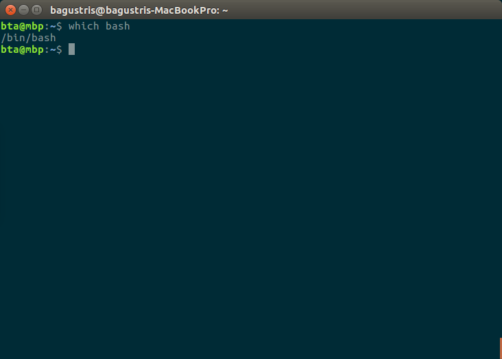

### Latar Belakang
Pada level tinggi, kompuer melakukan empat hal berikut:
1.  Menjalankan program
2.  Menyimpan data
3.  Berkomunikasi dengan komputer dan perangkat lainnya, dan
4.  Berinteraksi dengan kita

Empat fungsi komputer tersebut dapat dilakukan dengan berbagai cara,
melalui divais input maupun output dari komputer, seperti mengetik,
menggambar, merekam video, menggunakan touchpad dan keyboards.

Cara paling konvensional berinteraksi dengan komputer adalah
melalui keyboard, meski teknonologi graphical user interface, **GUI**,
berkembang pesat sejak 1980-an. Salah satu akar kata GUI berasal dari film 
Doug Engelbar's pada tahun 1969 yang bisa dilihat pada link ini, 
"[The Mother of All Demos](http://www.youtube.com/watch?v=a11JDLBXtPQ)".

### The Command-Line Interface
Kembali pada tahun antara 1950 sampai tahun 1980,
satu-satunya cara interaksi manusia dengan komputer adalah
dengan **CLI**, command-line interface.
Maka setelah adanya **GUI** tahun 1980an, interface atau
antar muka komputer terbagi menjadi dua:

   - **command-line interface**, or CLI,
   - **graphical user interface**, or GUI,

Workflow dari CLI adalah **read-evaluate-print-loop**, atau REPL:
artinya user ketika user mengetikkan perintah pada terminal
kemudian menekan enter (evaluate), maka komputer akan membaca perintah tersebut,
mengeksekusi dan menampilkan outpunya. Begitu seterusnya, **loop**, sampai
user keluar atau komputer dimatikan.

### The Shell
Dari penjelasan sebelumnya, user mengetikkan perintah kemudian outputnya akan muncul. 
Benarkah demikian? Ada perantara diantaranya yang dinamakan **command shell**.
Ketika user mengetikkan perintah, maka sebenarnya user mengetetikkan perintah shell
yang hanya bisa difahami oleh komputer jika perintah tersebut ada pada command shell tersebut.
Dinamakan shell karena melingkupi atau menghubungkan user dengan sistem operasi komputer.

Shell adalah program komputer sebagaimana program lainnya, yang paling banyak digunakan
adalah Bash, singkatan dari Bourne Again SHell yang diambil dari nama pembuatnya, Stephen Bourne.
Bash adalah shell default pada hampir semua Linux dan Unix modern. Selain bash ada jenis shell lainnya,
ksh, zsh dan csh.

### Why bother?
Kenapa memakai bash jika anda bisa tinggal klik sana-sini? Powerful. Bash sangat powerfull.
Ketika anda mengklik pada **GUI**, sebenarnya ada dua step yakni anda mengklik dan diterjemahkan 
oleh komputer yang biasanya berupa bash command.

Dengan menggunakan bash langsung anda akan lebih cepat dan pada kasus-kasus tertentu,
misal merename 100 file dalam satu folder, hanya bisa diselesaikan dengan bash shell.
Perhatikan contoh di bawah ini.

## Nelle's Pipeline: Starting Point

Nelle Nemo, seorang marine biologist,
baru saja menyelesaikan survey enam bulan tentang
has just returned from a six-month survey of the
[North Pacific Gyre](http://en.wikipedia.org/wiki/North_Pacific_Gyre),
dimana dia mengambil data dari kehidupan *gelatinous marine* di
[Great Pacific Garbage Patch](http://en.wikipedia.org/wiki/Great_Pacific_Garbage_Patch).
Dia memiliki total 1520 samples dan sekarang dia membutuhkan beberapa hal sbb:

1.  Menjalankan setiap sampel pada mesin uji
    yang akan mengukur ketersediaan 300 protein yang berbeda.
    Luaran dari mesin (komputer) untuk setiap sampel adalah
    sebuah file, satu baris untuk tiap proteinnya.
2.  Menghitung statistik dari tiap protein secara terpisah
    menggunakan program dari pembimbingnya yang disebut `goostat`.
3.  Membandingkan statistik dari tiap protein, dimana
    tiap protein lain dibandingkan dengan protein lainnya, dengan
    program yang dibuat oleh mahasiswa lainnya yang disebut `goodiff`.
4.  Menuliskan hasilnya.
    Pembimbingnya menginginkan Nelle Nemo dapat menyelesaikan
    eksperimen ini pada akhir bulan sehingga papernya dapat dimuat
    pada *special issue* **Aquatic Goo Letters**.

Untuk memproses tiap sampel, dibutuhkan waktu satu jam setengah. Berita baiknya,
hanya dibutuhkan dua menit untuk set up tiap sampel. Karena lab-nya memiliki
delapan komputer ujicoba yang dapat digunakan secara parallel, langkah-langkah ini
"hanya" membutuhkan waktu dua minggu.

Berita buruknya, jika dia (Nelle Nemo), menjalankan program `goostat` dan `goodif`
secara manual satu per satu, dia akan membutuhkan waktu untuk memasukkan nama file
dan mengklik "OK" sebanyak 46370 kali
(1520 runs of `goostat`, plus 300*299/2 (half of 300 times 299) runs of `goodiff`).
selama 30 detik untuk setiap satu kali.
Total dibutuhkan waktu lebih dari dua minggu.
Tidak hanya kehilangan deadline dari paper, 
kemungkinan untuk dapat mengetikkan perintah dan nama file dengan benar 
secara praktek sangat kecil kemungkinannya (0%).

Pelajaran-pelajaran selanjutnya pada tutorial shell ini 
akan menunjukkan bagaimana kita dapat menggunakan shell
untuk mengotomasi pekerjaan berulang pada kasus Nella Nemo tersebut.

Goal yang ingin kita tuju adalah, komputer Nemo dapat bekerja 24 jam
non-stop sementara Nemo memulis papernya. Sebagai bonus,sekali dia bisa
menjalankan proses untuk sampel-sampelnya secara bersamaan, dia dapat 
menggunakannya kembali ketika dia mendapatkan data baru.

Daftar bacaan:
1. [20 tahun Linux: Menuju kemerdaan ber-OS](http://www.bagustris.tk/2011/09/20-tahun-linux-os-menuju-kebebasan-ber.html)
2. [Kenapa memakai Ubuntu](http://www.bagustris.tk/2014/03/kenapa-memakai-ubuntu.html)
